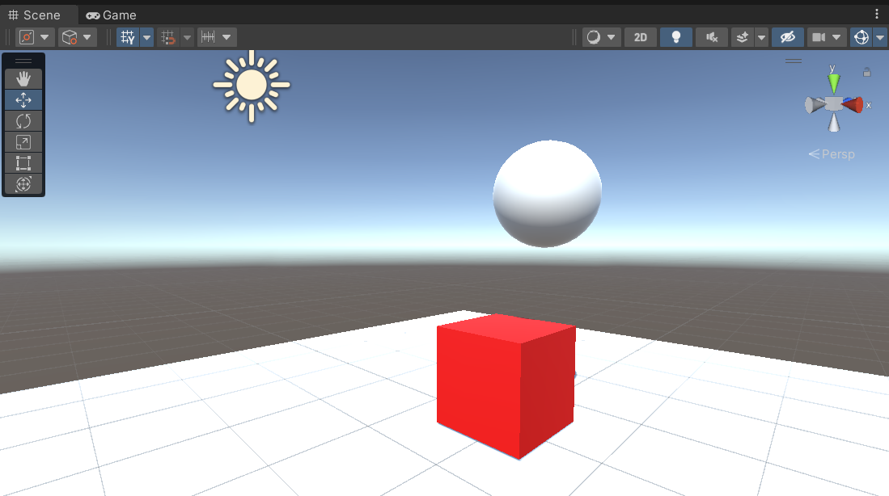
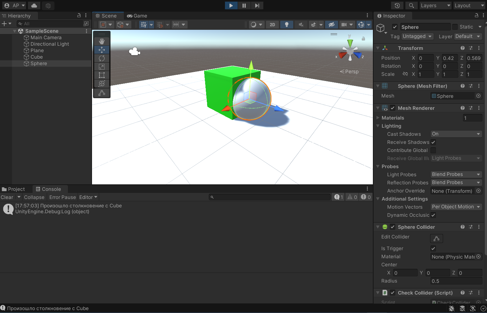
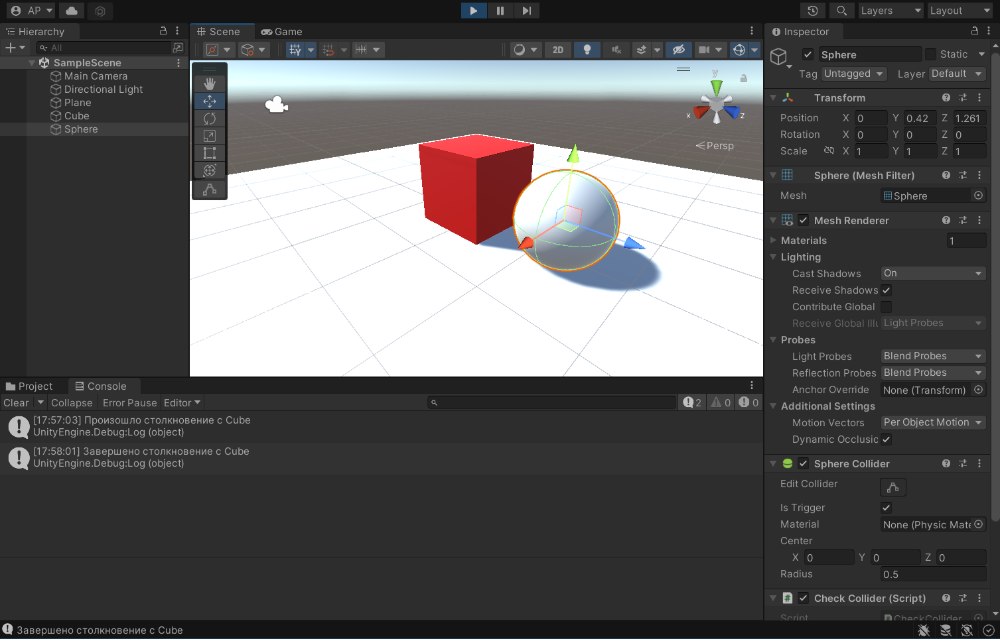
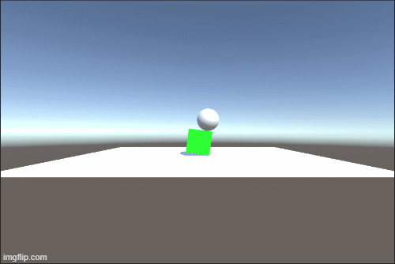

# Основы работы с Unity
Отчет по лабораторной работе #1 выполнила:
- Рзаева Арзу Масуд гызы
- РИ300012
Отметка о выполнении заданий:

| Задание | Выполнение | Баллы |
| ------ | ------ | ------ |
| Задание 1 | * | 60 |
| Задание 2 | # | 20 |
| Задание 3 | # | 20 |

знак "*" - задание выполнено; знак "#" - задание не выполнено;

Работу проверили:
- к.т.н., доцент Денисов Д.В.
- к.э.н., доцент Панов М.А.
- ст. преп., Фадеев В.О.

[](https://nodesource.com/products/nsolid)

[](https://travis-ci.org/joemccann/dillinger)

Структура отчета

- Данные о работе: название работы, фио, группа, выполненные задания.
- Цель работы.
- Задание 1.
- Код реализации выполнения задания. Визуализация результатов выполнения (если применимо).
- Задание 2.
- Код реализации выполнения задания. Визуализация результатов выполнения (если применимо).
- Задание 3.
- Код реализации выполнения задания. Визуализация результатов выполнения (если применимо).
- Выводы.
- ✨Magic ✨

## Цель работы
Ознакомиться с основными функциями Unity и взаимодействием с объектами внутри редактора.

## Задание 1
### Пошагово выполнить каждый пункт раздела "ход работы" с описанием и примерами реализации задач
Ход работы:
- Создать новый проект из шаблона 3D – Core. Проверить, что настроена интеграция редактора Unity и Visual Studio Code. 
- Создать объекты Plane, Cube, Sphere. Установить компонент Sphere Collider для объекта Sphere. Настроить Sphere Collider в роли триггера. Объект куб перекрасить в красный цвет. Добавить кубу симуляцию физики, при это куб не должен проваливаться под
Plane.



- Написать скрипт, который будет выводить в консоль сообщение о том, что объект Sphere столкнулся с объектом Cube. При столкновении Cube должен менять свой цвет на зелёный, а при завершении столкновения обратно на красный.

```c#

public class CheckCollider : MonoBehaviour
{
    // Start is called before the first frame update
    void Start()
    {
        
    }

    // Update is called once per frame
    void Update()
    {
        
    }

    private void OnTriggerEnter(Collider other) {
        Debug.Log("Произошло столкновение с " + other.gameObject.name);
        other.GetComponent<Renderer>().material.SetColor("_Color", Color.green);
    }
    
    private void OnTriggerExit(Collider other) {
        Debug.Log("Завершено столкновение с " + other.gameObject.name);
        other.GetComponent<Renderer>().material.SetColor("_Color", Color.red);
    }
}

```
Столкновение:


Конец столкновения:


### Бонус
В качестве отработки навыков был создан эффект "взрыва" сферы при столкновении.



```c#
using System.Collections;
using System.Collections.Generic;
using UnityEngine;

public class DestroyObject : MonoBehaviour
{
    // Start is called before the first frame update
    public float radius = 5.0f;
    public float force = 10.0f;
    public GameObject prefabBoomPoint;
    public GameObject prefabBoomSphere;
    
    void Start()
    {

    }

    // Update is called once per frame
    void Update()
    {

    }

    private void OnCollisionEnter(Collision other)
    {
        if (other.gameObject.name == "Sphere")
        {
            Destroy(other.gameObject);
            Vector3 boomPosition = other.gameObject.transform.position;
            Instantiate(prefabBoomPoint, other.gameObject.transform.position, other.gameObject.transform.rotation);
            Instantiate(prefabBoomSphere, other.gameObject.transform.position, other.gameObject.transform.rotation);
            Collider[] colliders = Physics.OverlapSphere(boomPosition, radius);
            foreach (Collider hit in colliders)
            {
                Rigidbody rb = GetComponent<Rigidbody>();
                if (rb != null)
                {
                    rb.AddExplosionForce(force, boomPosition, radius, 3.0f);
                }
            }
        }
    }
}


```

## Выводы

Таким образом, в ходе лабораторной работы я ознакомилась с интерфейсом и основными функциями Unity, а также научилась взаимодействовать с объектами внутри редактора.

| Plugin | README |
| ------ | ------ |
| Dropbox | [plugins/dropbox/README.md][PlDb] |
| GitHub | [plugins/github/README.md][PlGh] |
| Google Drive | [plugins/googledrive/README.md][PlGd] |
| OneDrive | [plugins/onedrive/README.md][PlOd] |
| Medium | [plugins/medium/README.md][PlMe] |
| Google Analytics | [plugins/googleanalytics/README.md][PlGa] |

